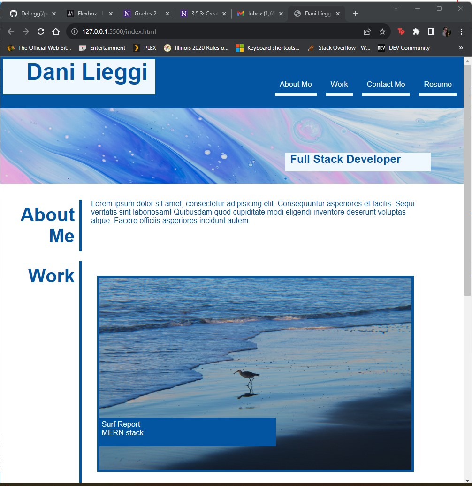
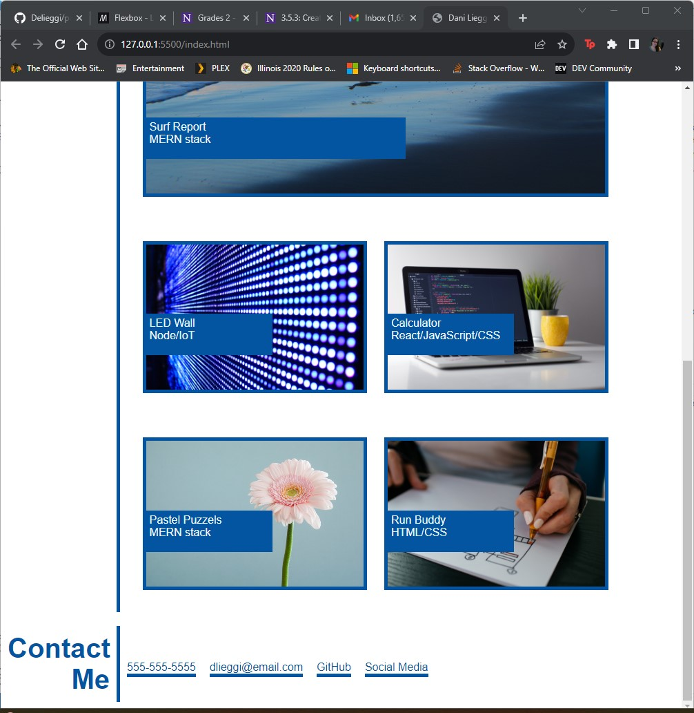

# Dani Lieggi's Full Stack Portfolio

## Description

As a student in a coding bootcamp, once the course is finished, I will want to seek a position in the industry and it will be important to have a live portfolio to show my work to potential employers. Creating a portfolio using the HTML and CSS I have learned in the course thus far, also challenges me to take the information I have learned and use it in a practical way. I believe there is always a jump in comprehension between being presented information and having to create something with it yourself. I definitely feel building this portfolio from scratch gave me the opportunity to prove and deepen my understanding of HTML/CSS. In order to build this portfolio page, I needed to understand how to use HTML to create a basic content structure and then style it using CSS concepts such as classes, ids, positioning, media queries, etc.

## Installation

n/a

## Usage

Once completed projects are linked to this page as I go through the course, you can click the image icons to be taken to them. 

 
 

## Credits

I received assistance from one of the coding camp tutors, James Compagnoni who assisted me with some of the flexbox layout, especially as it pertained to the work and contact me section. 

I also watched a tutorial on YouTube regarding the jump links on my portfolio page:
https://www.youtube.com/watch?v=k4EGA95ZK4o

## License

Please see MIT license in GitHub. 